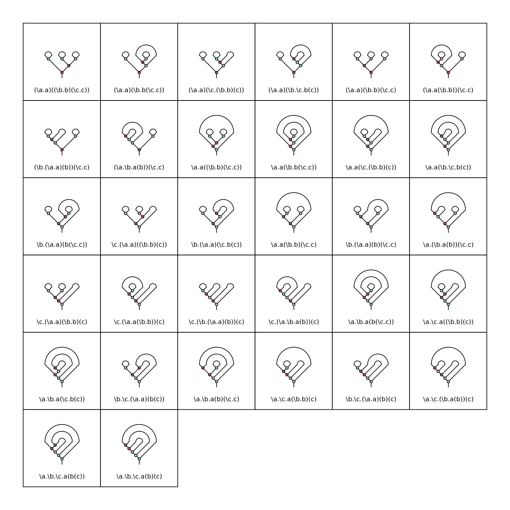
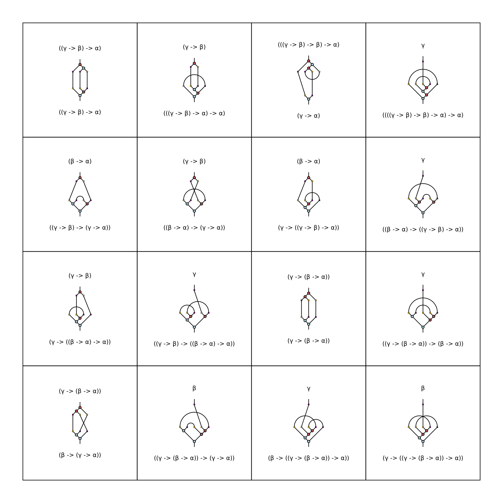
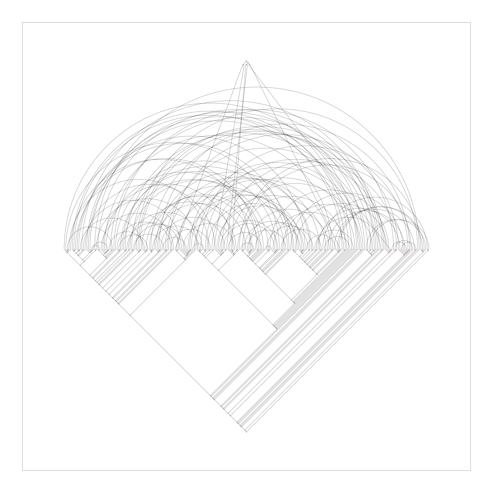

# LinLam: a Haskell library for experimental linear lambda calculus

A collection of Haskell routines for generating, normalizing, typing, diagrammifying, and otherwise playing with linear lambda terms.

# Some related tools

* George Kaye's [λ-term visualiser](https://www.georgejkaye.com/lambda-visualiser/visualiser.html) and [gallery](https://www.georgejkaye.com/lambda-visualiser/gallery)
* Jason Reed's [Interactive Lambda Maps Toy](https://jcreedcmu.github.io/demo/lambda-map-drawer/public/index.html)

# Dependencies

* [data-memocombinators](https://hackage.haskell.org/package/data-memocombinators) (for term generation)
* [diagrams](https://hackage.haskell.org/package/diagrams) (for diagram generation)
* [random-shuffle](http://hackage.haskell.org/package/random-shuffle-0.0.4/docs/System-Random-Shuffle.html) (for random generation)

# Documentation

Not much for now!

# Example sessions

## Enumerating some terms, printing and normalizing them

```haskell
Prelude> :load LinLam
[ 1 of 10] Compiling Permutations     ( Permutations.hs, interpreted )
[ 2 of 10] Compiling LinLam.Diagrams.Matching ( LinLam/Diagrams/Matching.hs, interpreted )
[ 3 of 10] Compiling LinLam.Diagrams.Tree ( LinLam/Diagrams/Tree.hs, interpreted )
[ 4 of 10] Compiling LinLam.Diagrams.Grid ( LinLam/Diagrams/Grid.hs, interpreted )
[ 5 of 10] Compiling LinLam.Core      ( LinLam/Core.hs, interpreted )
[ 6 of 10] Compiling LinLam.Random    ( LinLam/Random.hs, interpreted )
[ 7 of 10] Compiling LinLam.Typing    ( LinLam/Typing.hs, interpreted )
[ 8 of 10] Compiling LinLam.Pretty    ( LinLam/Pretty.hs, interpreted )
[ 9 of 10] Compiling LinLam.Diagrams  ( LinLam/Diagrams.hs, interpreted )
[10 of 10] Compiling LinLam           ( LinLam.hs, interpreted )
Ok, modules loaded: LinLam, LinLam.Core, LinLam.Diagrams, LinLam.Diagrams.Grid, LinLam.Diagrams.Matching, LinLam.Diagrams.Tree, LinLam.Pretty, LinLam.Random, LinLam.Typing, Permutations.
*LinLam> allLT 5 0
[A (L 0 (V 0)) (L 1 (V 1)),L 0 (A (V 0) (L 1 (V 1))),L 1 (A (L 0 (V 0)) (V 1)),L 0 (L 1 (A (V 0) (V 1))),L 1 (L 0 (A (V 0) (V 1)))]
*LinLam> mapM_ printLT (allLT 5 0)
(\a.a)(\b.b)
\a.a(\b.b)
\b.(\a.a)(b)
\a.\b.a(b)
\b.\a.a(b)
*LinLam> allPT 5 0
[A (L 0 (V 0)) (L 1 (V 1)),L 0 (A (V 0) (L 1 (V 1))),L 1 (A (L 0 (V 0)) (V 1)),L 0 (L 1 (A (V 0) (V 1)))]
*LinLam> mapM_ printLT (allPT 5 0)
(\a.a)(\b.b)
\a.a(\b.b)
\b.(\a.a)(b)
\a.\b.a(b)
*LinLam> [length (allLT (3*n+2) 0) | n <- [0..4]]
[1,5,60,1105,27120]
*LinLam> [length (allPT (3*n+2) 0) | n <- [0..6]]
[1,4,32,336,4096,54912,786432]
*LinLam> [length (allBPT (3*n+1) 1) | n <- [0..6]]
[1,1,4,24,176,1456,13056]
*LinLam> normalize (L 0 $ A (L 1 $ V 1) (V 0))
L 0 (V 0)
*LinLam> mapM_ printLT $ filter (betaEq (L 0 $ V 0)) (allLT 5 0)
(\a.a)(\b.b)
\b.(\a.a)(b)
```

## Generating a random closed term and making some observations

```haskell
*LinLam> t <- randomLT (3*100+2)
*LinLam> printLT t
\a.\b.\c.\d.\e.(\f.(\g.\h.\i.\j.\k.\l.\m.(\n.\o.\p.\q.\r.\s.\t.\u.\v.\w.\x.\y.(\z.(\X0.\X1.\X2.z(g(\X3.\X4.\X5.\X6.\X7.\X8.\X9.\X10.\X11.\X12.\X13.\X14.\X15.\X16.\X17.\X18.\X19.\X20.\X21.(\X22.\X23.\X24.\X25.\X26.X6(\X27.\X28.\X29.\X30.\X31.\X32.\X33.X15(X2)(d(\X34.\X35.\X36.(\X37.\X38.X16(\X39.\X40.\X41.\X42.l(\X43.X18((\X44.\X45.\X46.c(X12(X23(X22))(\X47.\X48.X33(\X49.\X50.h(m(X29))(X50)((\X51.(\X52.X47(\X53.X13(\X54.\X55.(\X56.\X57.X32(b(s))((\X58.(\X59.(\X60.\X61.X53((\X62.\X63.\X64.X3(\X65.\X66.(\X67.X67)(X66(\X68.(\X69.n((\X70.X59(\X71.\X72.X7(X11)(X5(\X73.p(u(r)(X68))(X51)(X38(X65(X28(X37)(X43))(X64(X63(X41)))(q))(X40(X44(X24)))(X69)(X19(X4)(X56)(X52)(X27(X39))(X57(X1(X46(X60)(X17)(X55(X36(X70)(X73))))))(X71)(X72(X35))(X21)))(X61)(X48)))(w)(X62)(X20))(X54))(X58)(X30)))(X45)))))(X42)))(X25))(X49))(y)(X8)))(v))))(x))(f)(X26(X31)(X9)))(i))))(t)(X10))(X14)))))(X34)))))(X0))))(k))(o))(e(j)))(a))(\X74.X74)
*LinLam> size (normalize t)
245
*LinLam> size t - size (normalize t)
57
*LinLam> length [u | u <- subterms t, arity u == 0]
3
```

## Type inference

```haskell
*LinLam> mapM_ (\t -> let (_,tau,_) = synth t in putStrLn (prettyLT t ++ " : " ++ prettyType tau)) (allNLT 8 0)
\a.a(\b.b(\c.c)) : (((((γ -> γ) -> β) -> β) -> α) -> α)
\a.a(\b.\c.b(c)) : ((((γ -> β) -> (γ -> β)) -> α) -> α)
\a.a(\c.\b.b(c)) : (((γ -> ((γ -> β) -> β)) -> α) -> α)
\a.a(\b.b)(\c.c) : (((γ -> γ) -> ((β -> β) -> α)) -> α)
\a.\b.a(b(\c.c)) : ((β -> α) -> (((γ -> γ) -> β) -> α))
\b.\a.a(b(\c.c)) : (((γ -> γ) -> β) -> ((β -> α) -> α))
\a.\b.a(\c.b(c)) : (((γ -> β) -> α) -> ((γ -> β) -> α))
\b.\a.a(\c.b(c)) : ((γ -> β) -> (((γ -> β) -> α) -> α))
\a.\c.a(\b.b(c)) : ((((γ -> β) -> β) -> α) -> (γ -> α))
\c.\a.a(\b.b(c)) : (γ -> ((((γ -> β) -> β) -> α) -> α))
\a.\b.a(b)(\c.c) : ((γ -> ((β -> β) -> α)) -> (γ -> α))
\b.\a.a(b)(\c.c) : (γ -> ((γ -> ((β -> β) -> α)) -> α))
\a.\c.a(\b.b)(c) : (((γ -> γ) -> (β -> α)) -> (β -> α))
\c.\a.a(\b.b)(c) : (β -> (((γ -> γ) -> (β -> α)) -> α))
\a.\b.\c.a(b(c)) : ((β -> α) -> ((γ -> β) -> (γ -> α)))
\b.\a.\c.a(b(c)) : ((γ -> β) -> ((β -> α) -> (γ -> α)))
\a.\c.\b.a(b(c)) : ((β -> α) -> (γ -> ((γ -> β) -> α)))
\c.\a.\b.a(b(c)) : (γ -> ((β -> α) -> ((γ -> β) -> α)))
\b.\c.\a.a(b(c)) : ((γ -> β) -> (γ -> ((β -> α) -> α)))
\c.\b.\a.a(b(c)) : (γ -> ((γ -> β) -> ((β -> α) -> α)))
\a.\b.\c.a(b)(c) : ((γ -> (β -> α)) -> (γ -> (β -> α)))
\b.\a.\c.a(b)(c) : (γ -> ((γ -> (β -> α)) -> (β -> α)))
\a.\c.\b.a(b)(c) : ((γ -> (β -> α)) -> (β -> (γ -> α)))
\c.\a.\b.a(b)(c) : (β -> ((γ -> (β -> α)) -> (γ -> α)))
\b.\c.\a.a(b)(c) : (γ -> (β -> ((γ -> (β -> α)) -> α)))
\c.\b.\a.a(b)(c) : (β -> (γ -> ((γ -> (β -> α)) -> α)))
```

## Making diagrams

Generate a table of string diagrams (λ-graphs) representing the term structure of all closed planar terms of size 8 (in a file named `diagrams/pt8,0.svg`):

```haskell
*LinLam> renderLTs' (allPT 8 0) "diagrams/pt8,0"
```


Generate a table of string diagrams (proof-nets) representing the type structure of all one-variable-open normal bridgeless terms of size 7:

```haskell
*LinLam> trenderNLTs' (allNBLT 7 1) "diagrams/nblt7,1"
```


Generate a random one-variable-open bridgeless term of size 451, normalize it, and diagram its type structure (just the pure graphical diagram, without any Greek annotations):

```haskell
*LinLam> t <- randomBLT (3*150+1)
*LinLam> trenderNLT (normalize t) "diagrams/randomnlt"
```


# License

Free to use under an [MIT License](LICENSE).
